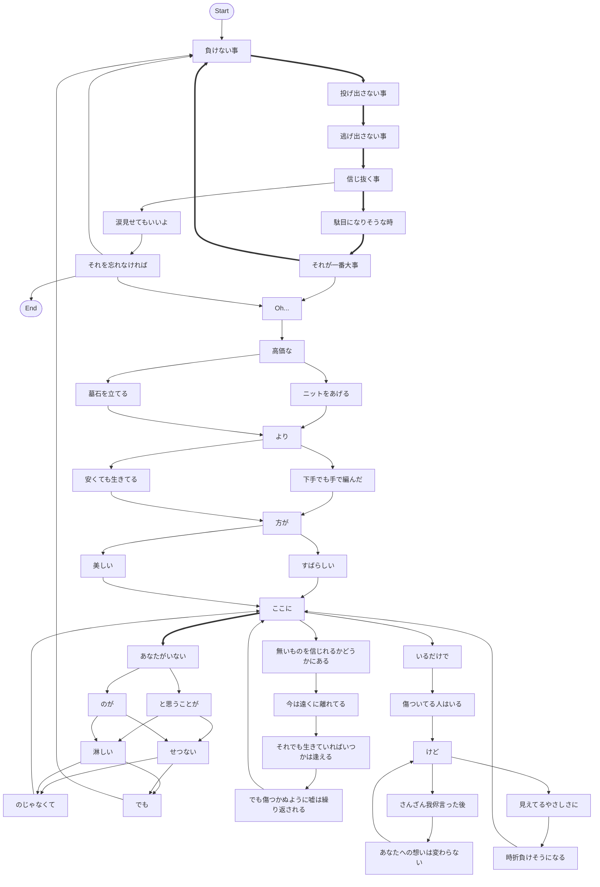

```mermaid
  graph TB
    Start([Start])
    End([End])
    Oh[Oh...]
    投げ出さない事 ==> 逃げ出さない事;
    逃げ出さない事 ==> 信じ抜く事;
    負けない事 ==> 投げ出さない事;
    信じ抜く事 ==> 駄目になりそうな時;
    駄目になりそうな時 ==> それが一番大事;
    ここに ==> あなたがいない;
    それが一番大事 ==> 負けない事;
    涙見せてもいいよ --> それを忘れなければ;
    信じ抜く事 --> 涙見せてもいいよ;
    のじゃなくて --> ここに;
    あなたがいない --> のが;
    でも --> 負けない事;
    Oh --> 高価な;
    あなたがいない --> と思うことが;
    無いものを信じれるかどうかにある --> 今は遠くに離れてる;
    それを忘れなければ --> End;
    それでも生きていればいつかは逢える --> でも傷つかぬように嘘は繰り返される;
    ニットをあげる --> より;
    それが一番大事 --> Oh;
    と思うことが --> せつない;
    見えてるやさしさに --> 時折負けそうになる;
    高価な --> ニットをあげる;
    それを忘れなければ --> Oh;
    淋しい --> でも;
    と思うことが --> 淋しい;
    それを忘れなければ --> 負けない事;
    けど --> さんざん我侭言った後;
    より --> 下手でも手で編んだ;
    下手でも手で編んだ --> 方が;
    方が --> 美しい;
    より --> 安くても生きてる;
    安くても生きてる --> 方が;
    方が --> すばらしい;
    すばらしい --> ここに;
    時折負けそうになる --> ここに;
    傷ついてる人はいる --> けど;
    せつない --> のじゃなくて;
    のが --> せつない;
    あなたへの想いは変わらない --> けど;
    けど --> 見えてるやさしさに;
    美しい --> ここに;
    今は遠くに離れてる --> それでも生きていればいつかは逢える;
    のが --> 淋しい;
    ここに --> 無いものを信じれるかどうかにある;
    高価な --> 墓石を立てる;
    Start --> 負けない事;
    せつない --> でも;
    墓石を立てる --> より;
    ここに --> いるだけで;
    いるだけで --> 傷ついてる人はいる;
    でも傷つかぬように嘘は繰り返される --> ここに;
    淋しい --> のじゃなくて;
    さんざん我侭言った後 --> あなたへの想いは変わらない;
```
